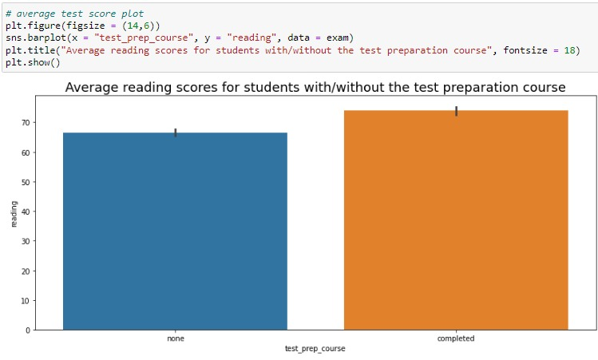
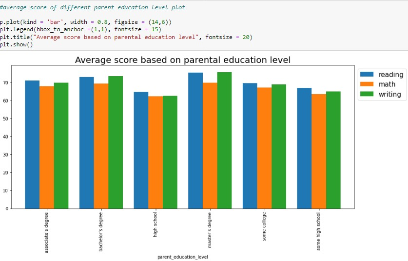
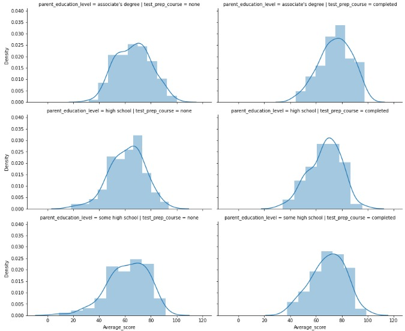
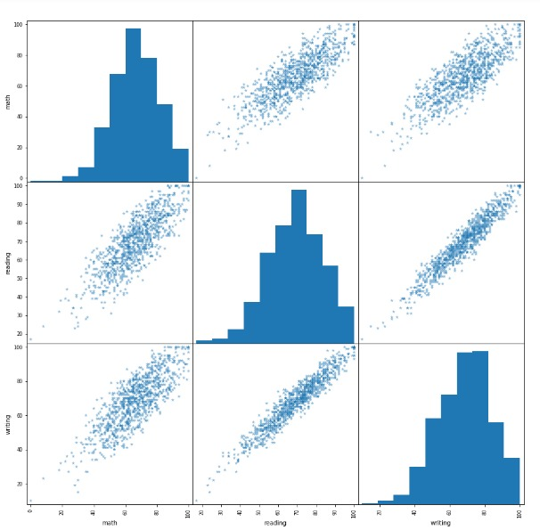

# Exam Analysis

  

## Introduction
The aim of this project is to exhibit my skills in analyzing and visualizing while create a report on an **Exam Report** to answer the proposed questions of a school principal.

**_Disclaimer_**: _All datasets and reports do not represent any company, institution or country, but just a dummy dataset to demonstrate capabilities in data visualization.

## Data Sourcing
Data was scrapped from Data camp competition and downloaded as a csv file. The code was executed using Jupyter notebook.

**The file has the following fields (source):**
- "gender" - male / female
- "race/ethnicity" - one of 5 combinations of race/ethnicity
- "parent_education_level" - highest education level of either parent
- "lunch" - whether the student receives free/reduced or standard lunch
- "test_prep_course" - whether the student took the test preparation course
- "math" - exam score in math
- "reading" - exam score in reading
- "writing" - exam score in writing

According to the competition, The school's principal wants to know if test preparation courses are helpful for students in her school. She also wants to explore the effect of parental education level on test scores.

## Problem Statement
1.	What are the average reading scores for students with/without the test preparation course?
2.	What are the average scores for the different parental education levels?
3.	Look at the effects within subgroups. Compare the average scores for students with/without the test preparation course for different parental education levels.
4.	The principal wants to know if students who perform well on one subject also score well on the others. Look at the correlations between scores.

## Data Visualization

**What are the average reading scores for students with/without the test preparation course?**

**What are the average scores for the different parental education levels?**

**Look at the effects within subgroups. Compare the average scores for students with/without the test preparation course for different parental education level.**

**The principal wants to know if students who performed well on one subject also score well on the others. Look at the correlations between scores.**

## Summary
- The students who completed the test preparation course had a higher reading average score compared to those who did not do the test preparation course.
- The exam scores for math, reading and writing are correlated with the parent education levels. Master's degree students achieve best average scores for the three exams while high school achieve the lowest average scores for the exams. The difference between the average scores for different parental education levels is not very wide. Average scores for different parent education levels increase with the educational level exposure; the more students advance in their education, the better their scores.
- Average scores for different parent education levels for those that completed the test preparation course and those that did not take the test preparation course show a symmetrical distribution. This shows that the test preparation course has no effect on the student's scores. After estimating the mean and the median, they all occurred at the same point for the different levels, thus a symmetrical distribution.
- The student's scores are highly positively correlated for the different subjects; a student who performs well on one subject also performs well on the others and likewise a student performing poorly in one subject performs poorly on the others.

## Conclusion
From the summary above, its concluded that the student that did well in the exams are the students that went through with the test preparatory course. It’s suggested that students should take test preparatory course for them to achieve better grades in their exams, either internal or external exams, also exploring the effect of parental education level on test scores proves encouraging as it positively affects the students' performance in school.

  

